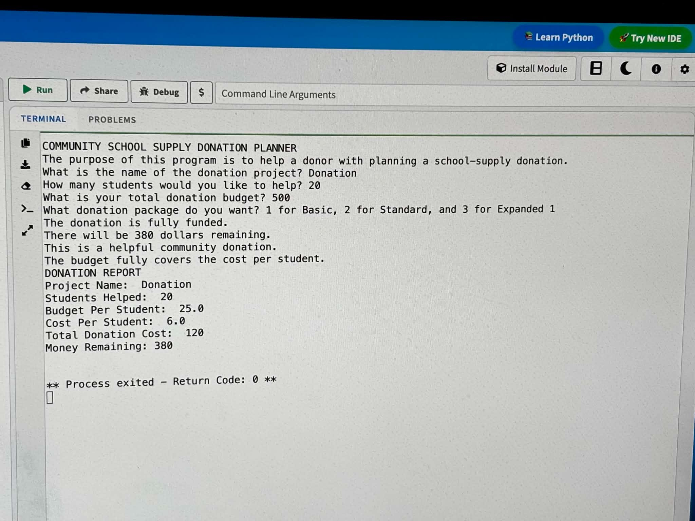
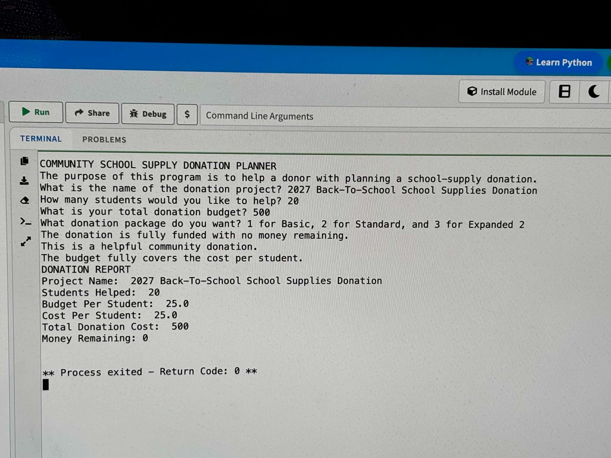
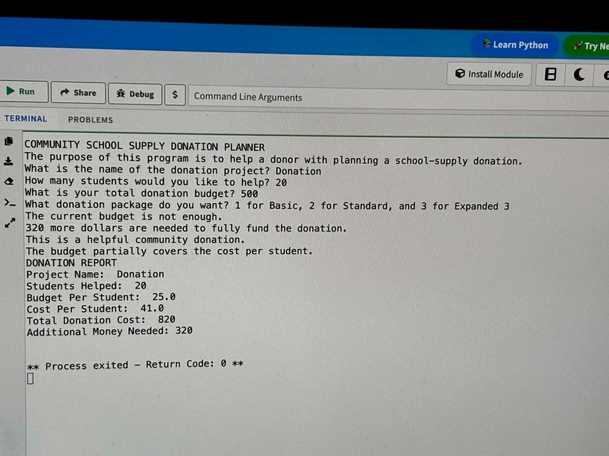
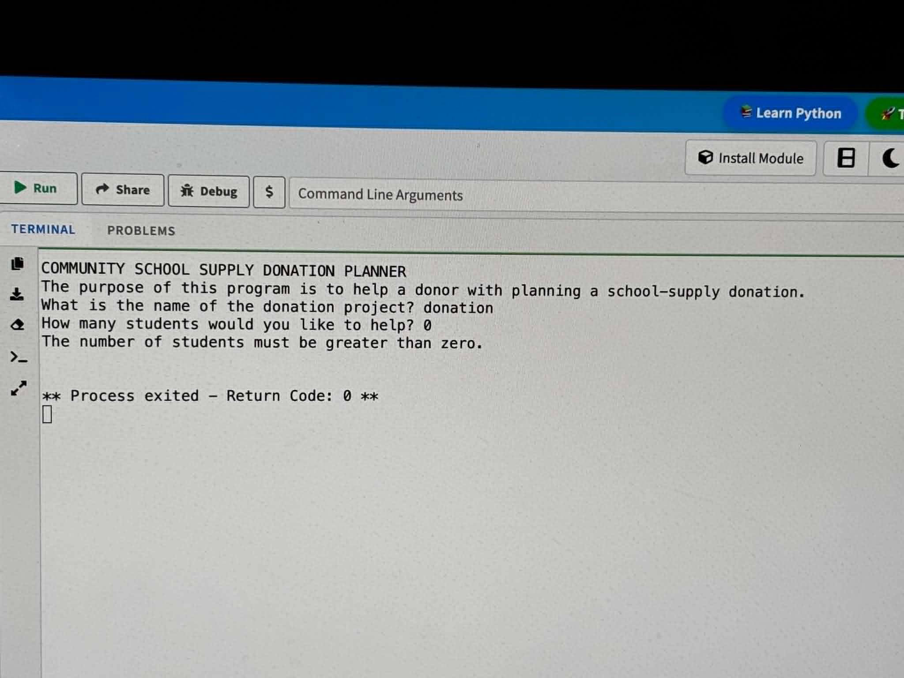
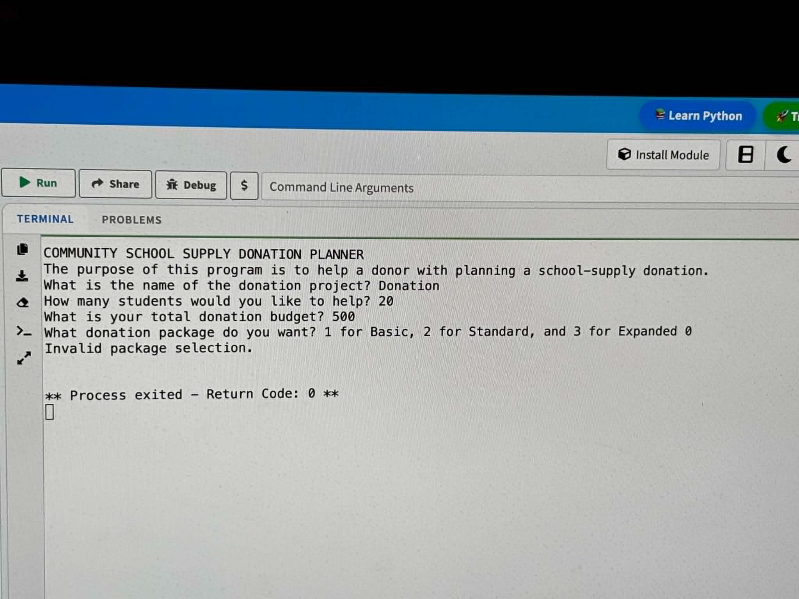

# Community School Supply Donation Planner

## About the Project

The Community School Supply Donation Planner is a Python program that helps donors estimate the cost of providing school supplies for students.

The program asks the user to enter:

- The project name
- The number of students
- The total donation budget
- A donation package

The program then calculates the donation cost, checks whether the budget is sufficient, and generates a clear financial report.

---

## Project Purpose

The purpose of this project is to use mathematics and computer programming to solve a real-world community problem.

A donor may want to help students but may not know whether a budget is large enough for the selected school-supply package. This program calculates the expected cost and explains whether the donation is fully funded.

---

## Donation Packages

### Basic Package

Each student receives:

- 1 notebook
- 1 pack of pencils
- 1 folder

**Cost per student: $6**

---

### Standard Package

Each student receives:

- 2 notebooks
- 1 pack of pencils
- 2 folders
- 1 backpack

**Cost per student: $25**

---

### Expanded Package

Each student receives:

- 3 notebooks
- 2 packs of pencils
- 3 folders
- 1 backpack
- 1 calculator

**Cost per student: $41**

---

## Features

The program can:

- Offer three donation-package choices
- Calculate the budget per student
- Calculate the cost per student
- Calculate the total donation cost
- Determine whether the donation is fully funded
- Display the money remaining
- Display the additional money needed
- Evaluate the donation size
- Evaluate how much of the cost is covered
- Reject an invalid package selection
- Prevent division by zero when there are no students
- Generate a donation report

---

## Skills Demonstrated

This project demonstrates:

- Python variables
- User input
- Integer conversion
- Arithmetic operations
- `if`, `elif`, and `else`
- Nested conditional statements
- Input validation
- Budget calculations
- Program testing
- Logical debugging
- Real-world problem solving

---

## Example Results

For 20 students and a budget of $500:

- The Basic Package costs $120, leaving $380.
- The Standard Package costs $500, leaving $0.
- The Expanded Package costs $820 and requires an additional $320.

---

## Testing

The program was tested with:

- Basic Package
- Standard Package
- Expanded Package
- Zero students
- An invalid package selection

All five primary test cases passed.

See `test-cases.md` for the complete testing record.

---

## What I Learned

Through this project, I learned that a program can run without displaying a Python error and still contain a logical error.

I learned how to:

- Separate cost per student from budget per student
- Validate input before performing calculations
- Test multiple possible situations
- Correct logical mistakes
- Improve a program through several versions

---

## Future Improvements

Future versions may include:

- Custom school-supply prices
- Additional supply items
- Custom donation packages
- Automatic comparison of all packages
- Functions to reduce repeated code
- Loops for repeated calculations
- Saving donation reports to a file
- A graphical user interface
- A web-based version

---

## Version

**Version 1.1**

This version includes corrected financial logic, input validation, package selection, and five completed test cases.

---

## Author

**Brayden Ta**

---

## Programming Language

**Python 3**

## Program Demonstration

### Basic Package

---

### Standard Package

---

### Expanded Package

---

### Zero Students

---

### Invalid Package Selection

